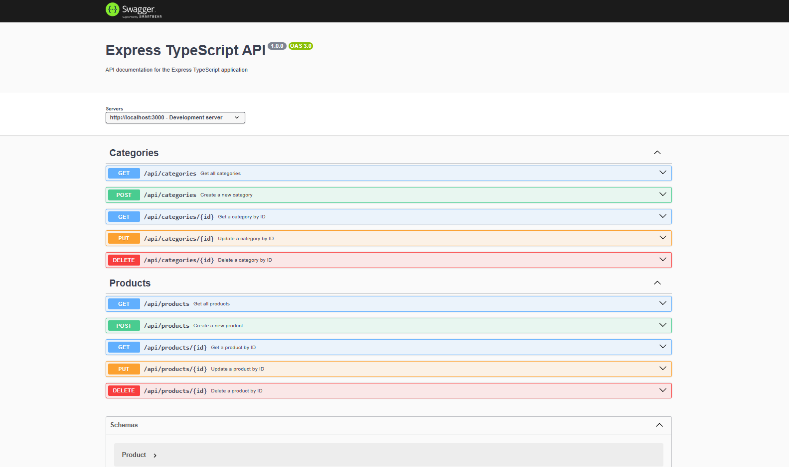

# express-typescript-template

<!-- SCREENSHOT -->



#### Getting Started

```bash
# start server on development
yarn dev

# build files
yarn build
```

API Docs

[http://localhost:3000/docs](http://localhost:3000/docs)

Prisma

```bash
# generate migration and update your @prisma/client (run this everytime you update your prisma schema)
yarn db:migrate

# sync prisma schema to your db
yarn db:push

# run prisma studio on http://localhost:5000
yarn db:studio
```

ESLint

```bash
# show lint errors
yarn lint

# fixing lint errors
yarn lint:fix
```

Prettier

```bash
# apply prettier to js,ts,json files while ignoring listing files in gitignore
yarn prettier

# apply prettier in all recognized file types in src directory
yarn prettier:fix
```
